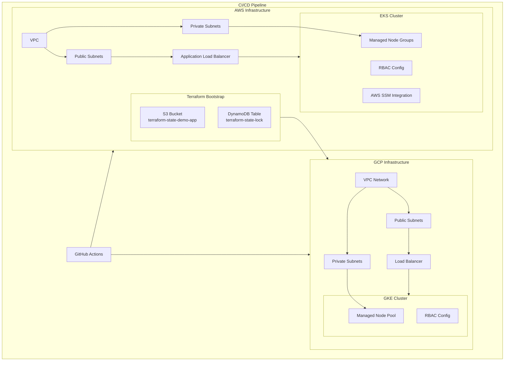
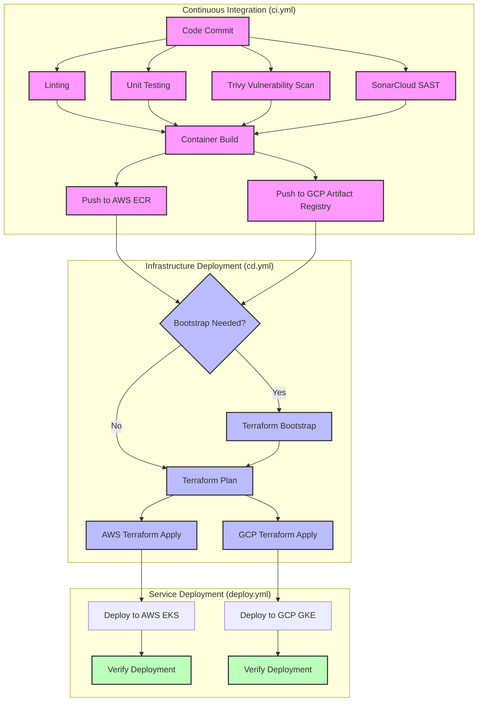

# Multi-Cloud Infrastructure Setup

This repository contains infrastructure as code (IaC) for deploying and managing applications across AWS and GCP cloud platforms.

## Table of Contents
1. [Architecture Overview](#architecture-overview)
2. [Directory Structure](#directory-structure)
3. [Prerequisites](#prerequisites)
4. [Infrastructure Components](#infrastructure-components)
5. [Security Implementation](#security-implementation)
6. [CI/CD Pipeline](#cicd-pipeline)
7. [Security Considerations](#security-considerations)

## Architecture Overview

The infrastructure is designed with a multi-cloud approach using:
- AWS EKS for container orchestration
- GCP GKE for redundancy
- Terraform for infrastructure provisioning
- GitHub Actions for CI/CD
- AWS SSM Parameter Store for secrets management

## Directory Structure

```
multi-cloud-setup/
├── terraform/
│   ├── bootstrap/    # Initial setup for Terraform state
│   │   ├── main.tf      # S3 bucket and DynamoDB setup
│   │   └── variables.tf # Bootstrap variables
│   ├── aws/         # AWS infrastructure
│   │   ├── main.tf      # VPC and networking
│   │   ├── eks.tf       # EKS cluster configuration
│   │   └── variables.tf # AWS variables
│   └── gcp/         # GCP infrastructure
│       ├── main.tf      # VPC and networking
│       ├── gke.tf       # GKE cluster setup
│       └── variables.tf # GCP variables
├── kubernetes/      # Kubernetes manifests
│   ├── deployment.yaml    # Application deployment
│   ├── rbac.yaml         # RBAC configuration
│   └── aws-ssm-config.yaml # AWS SSM integration
├── scripts/        # Automation scripts
│   └── db-backup.sh     # Database backup script
└── .github/
    └── workflows/  # CI/CD pipeline definitions
        ├── ci.yml       # Continuous Integration
        ├── cd.yml       # Infrastructure Deployment
        └── deploy.yml   # Service Deployment
```

## Prerequisites

1. **Required Tools**:
   - Terraform >= 1.0.0
   - AWS CLI
   - GCloud SDK
   - kubectl

2. **Cloud Accounts**:
   - AWS Account with admin access
   - GCP Project with owner permissions

## Infrastructure Components

### Infrastructure Diagram



### AWS Resources
- S3 bucket for Terraform state
- DynamoDB for state locking
- EKS cluster with managed node groups
- SSM Parameter Store for secrets

### GCP Resources
- GKE cluster
- VPC network

## Security Implementation

1. **Identity and Access Management**:
   - AWS IAM roles with least privilege
   - GCP service accounts
   - Kubernetes RBAC

2. **Secret Management**:
   - AWS SSM Parameter Store integration
   - Encrypted secrets in Kubernetes
   - Secure environment variables

## CI/CD Pipeline

### CI/CD Workflow Diagram



### Continuous Integration (`ci.yml`)
- Security scanning:
  - Trivy for vulnerability scanning
  - SonarCloud for SAST
- Container image building and pushing
- Multi-cloud registry support

### Infrastructure Deployment (`cd.yml`)
- Conditional bootstrap execution
- Directory-specific Terraform runs
- Infrastructure validation

### Service Deployment (`deploy.yml`)
- Automated Kubernetes deployments
- Rolling updates
- Multi-cluster deployment

## Security Considerations and Mitigations

### Implemented Security Features

1. **Container Security**:
   - Non-root container execution
   - Read-only root filesystem
   - Container scanning in CI pipeline
   ```yaml
   # From ci.yml
   - name: Run Trivy vulnerability scanner
     uses: aquasecurity/trivy-action@master
     with:
       scan-type: 'fs'
       severity: 'CRITICAL,HIGH'
   ```

2. **Secret Management**:
   - AWS SSM Parameter Store integration
   ```yaml
   # From aws-ssm-config.yaml
   apiVersion: secrets-store.csi.x-k8s.io/v1
   kind: SecretProviderClass
   metadata:
     name: aws-secrets
   ```

3. **Access Control**:
   - RBAC implementation
   ```yaml
   # From rbac.yaml
   apiVersion: rbac.authorization.k8s.io/v1
   kind: Role
   metadata:
     name: demo-app-role
   ```

### Security Best Practices

1. **Infrastructure**:
   - Infrastructure as Code
   - State file encryption
   - Least privilege access

2. **CI/CD**:
   - Automated security scanning
   - Multi-stage builds
   - Separate deployment workflows
